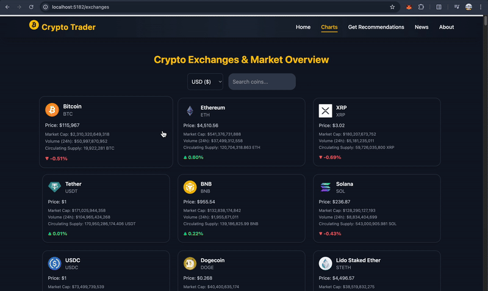

# Crypto Trader 

A modern **cryptocurrency dashboard** built for traders, investors, and enthusiasts.  
It provides **real-time market data, AI-driven crypto recommendations, latest crypto news, and exchange insights**.  

This project is ideal for:  
- 📈 **Crypto traders & investors** who want AI-powered insights and the latest market updates  
- 🧑‍💻 **Developers & learners** exploring how to integrate **multiple APIs** (CoinGecko, Gemini, News API) in a **React + Node.js + Tailwind** stack

## 🎥 Demo

<p align="center">
  
</p>


# ✨ Features

- 🔎 **Search & Explore Coins** – Browse top 1250 cryptocurrencies with real-time market data (CoinGecko API)  
- 🤖 **AI-Powered Recommendations** – Get Buy / Sell / Hold suggestions with reasoning (Gemini API)  
- 📰 **Latest Crypto News** – Stay updated with live crypto & blockchain headlines (News API)  
- 📊 **7-Day Price Trend Analysis** – Visualize short-term price movements and trends  
- 💾 **Smart Caching** – Coins data cached in browser storage for faster reloads  
- 🎨 **Modern UI/UX** – Built with **React + Tailwind CSS** for a clean, responsive interface  
- ⚡ **Fast & Dynamic** – Real-time API integration with smooth user experience  

## 🚀 Tech Stack

**Frontend:** React, React DOM, Tailwind CSS, JavaScript, Redux  
**Backend:** Node.js  
**AI:** Gemini API  
**Market Data:** CoinGecko API  
**News:** News API  
## 🌐 API Reference

### 1. CoinGecko API – Market Data
Used to fetch real-time cryptocurrency market information.  

**Get Top Coins**  
```http
GET https://api.coingecko.com/api/v3/coins/markets
```
**Gemini API – AI Recommendations**  
```http
GET POST https://generativelanguage.googleapis.com/v1beta/models/gemini-2.0-flash:generateContent

```
**News API – Latest Crypto Headlines**  
```http
GET GET https://newsapi.org/v2/everything?q=cryptocurrency&apiKey=YOUR_API_KEY

```


## Folder Structure
```
crypto_Trader/
│
├── public/                         # Static assets
│   ├── favicon.ico
│   ├── index.html
│   └── vite.svg
│
├── src/                            # Main source code
│   ├── assets/                     # Local images, logos, icons
│   ├── components/                 # Reusable components
│   │   ├── Navbar.jsx
│   │   ├── Footer.jsx
│   │   └── CoinCard.jsx
│   │
│   ├── pages/                      # Page-level components
│   │   ├── HomePage.jsx
│   │   ├── Exchanges.jsx
│   │   ├── News.jsx
│   │   └── Recommendations.jsx
│   │
│   ├── styles/                     # Custom CSS/Tailwind configs
│   │   └── globals.css
│   │
│   ├── App.jsx                     # Root app component
│   ├── main.jsx                    # React entry point
│   └── routes.jsx                  # All routes defined here
│
├── .env                            # Your API 
│                                    
│
├── .gitignore                       # Ignore node_modules, .env, build files
├── package.json                     # Dependencies and scripts
├── vite.config.js                   # Vite config
├── tailwind.config.js               # Tailwind config
├── postcss.config.js                # PostCSS config
├── README.md                        # Project documentation
└── LICENSE                          # (optional) Open-source license

```


